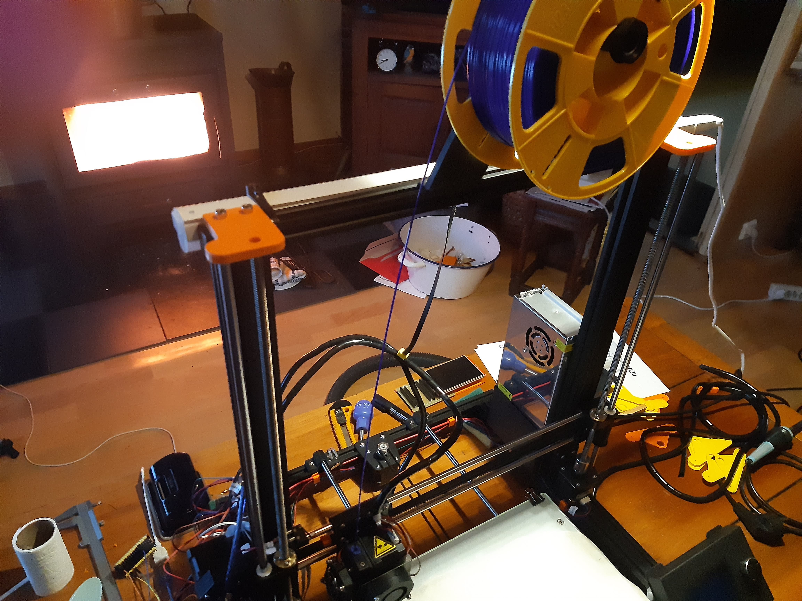
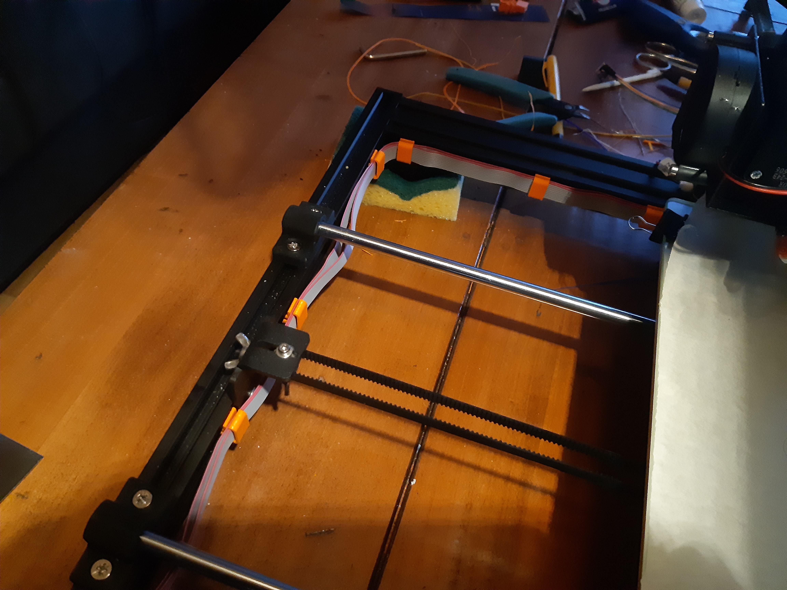
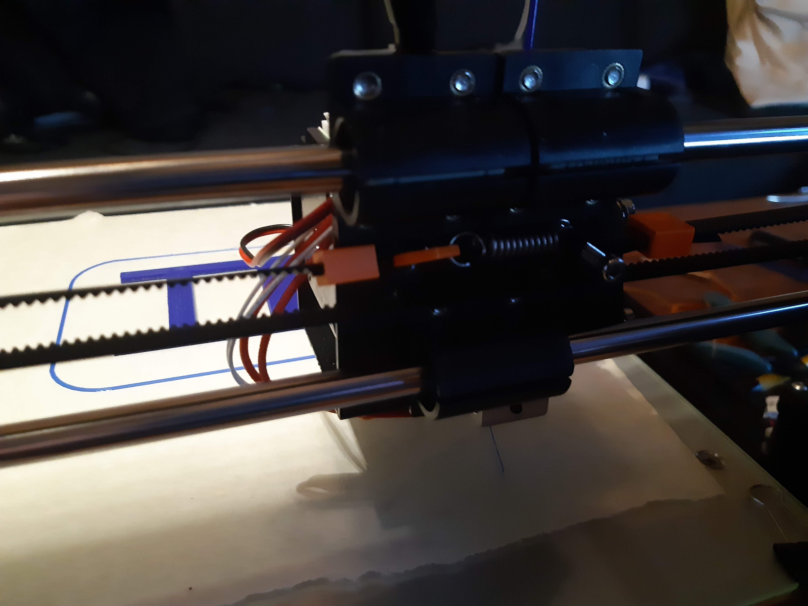
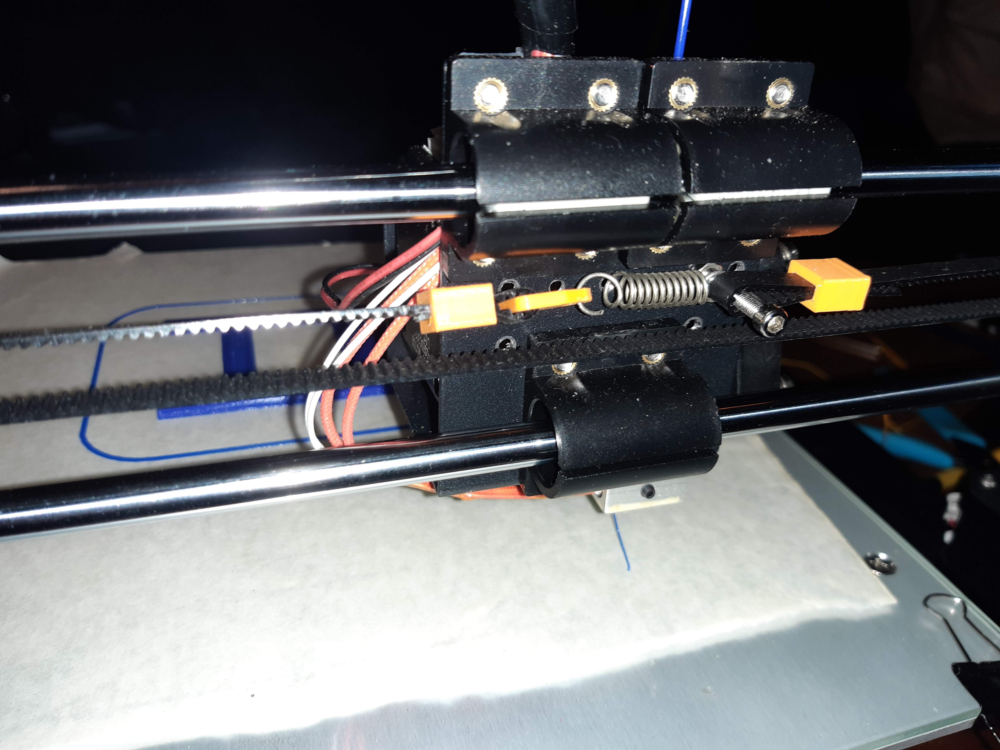
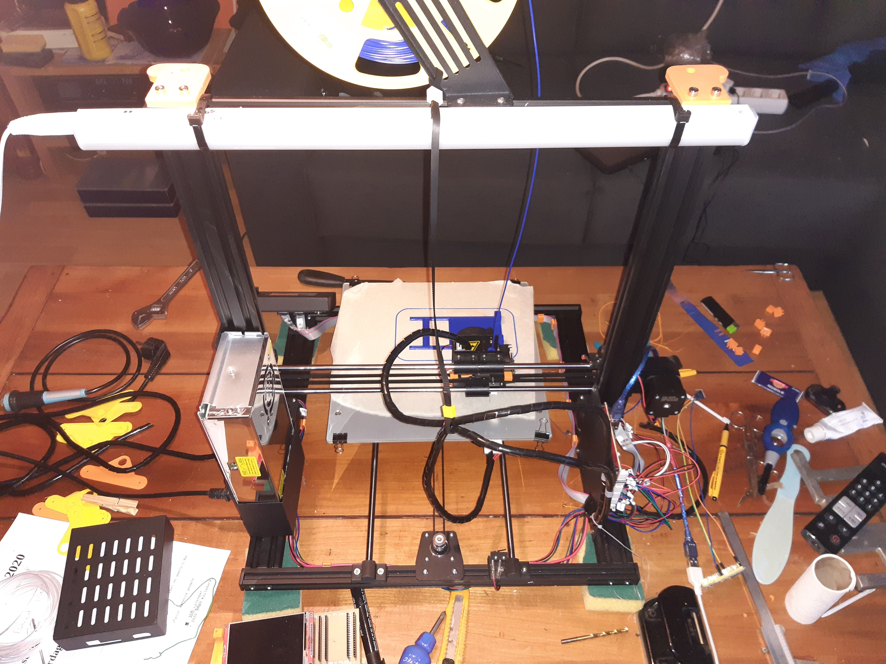
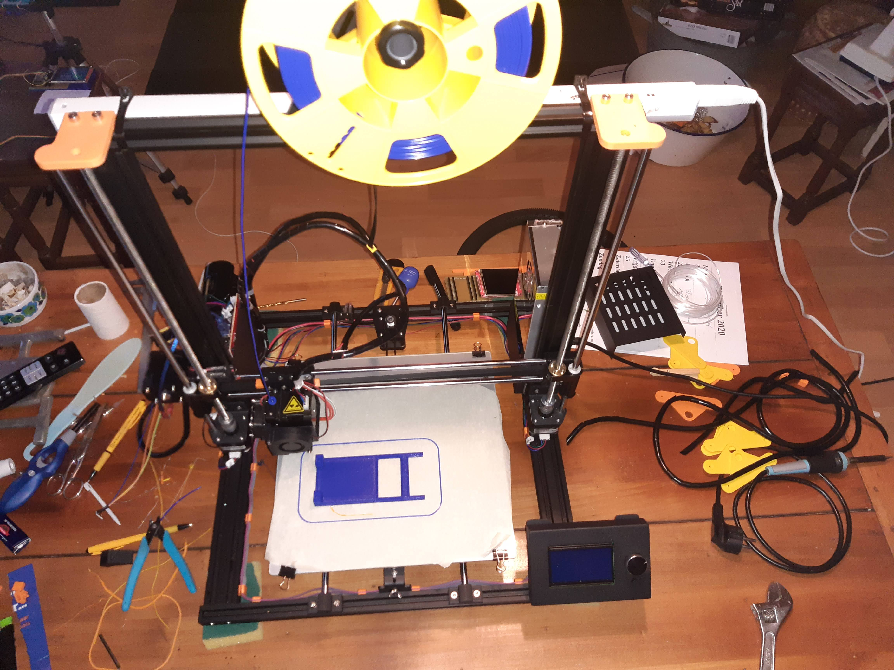

# Anet-A8-Plus 
# 140 Euo 3D printer 300x300x350mm includes shipping dec2020

wil not go that high in Z but the 300x300 is nice

a cheap 3d printer but nice frame design

but would like a belt between z axis to keep them timed/aligned

used a pull spring to tension the extruder axis == broke the printed tensioner
in old matix printer and plotter they also used spings to tension belts

pitty it can only beep and not play tone sounds like ender3
bit outdated PCB = but no complains for that money

directly replaced the shitty linear ball on soft axis for 
first printed PLA bus later ordered plastic linear slides in the wrong diameter ;-)
did not want to damage the soft axis with the garbage linear ball slides

some STL file i drawed in sketchup used for anet a8 plus 3d printer 
i also have an ender3 and a plastic anet but like this anet a8 plus frame design more
wanted to built something like this myself
but cannot buy the parts for 140 euo, so this is my last and final 3d printer ok for me 

2 top plates 8mm thick 1hole 8mm axis hole only 4mm deep
github renders the STL a bit stange
to lock the z=axis bar, instead of the ringlock 

belt block instead of zip ties or is it tys teis i dont know no ty-raps
and belt block for pullspring

cableclip not my design sorry = dont know who
but handy for flat ribbon cable
cable clip fits in aluminium extrusion
###

# my (NoPrusa) DutchOrange version of topplates

no ring needed

# PullSpring for belt tension

# ://www.ACTION.NL TL LED lamp 230vac 6watt 4euo

scrap leftover belt to keep the cables up

# my (NoPrusa) DutchOrange version of topplates

no ring needed

i dont know

## printing on sticker transfer paper (like painters paper stape)

## i am having problems to stick on glas

#
#
#
## ESP32 Dumb Thermostat && ESP32 Smart Thermostat
# http://www.Arduino.TK
